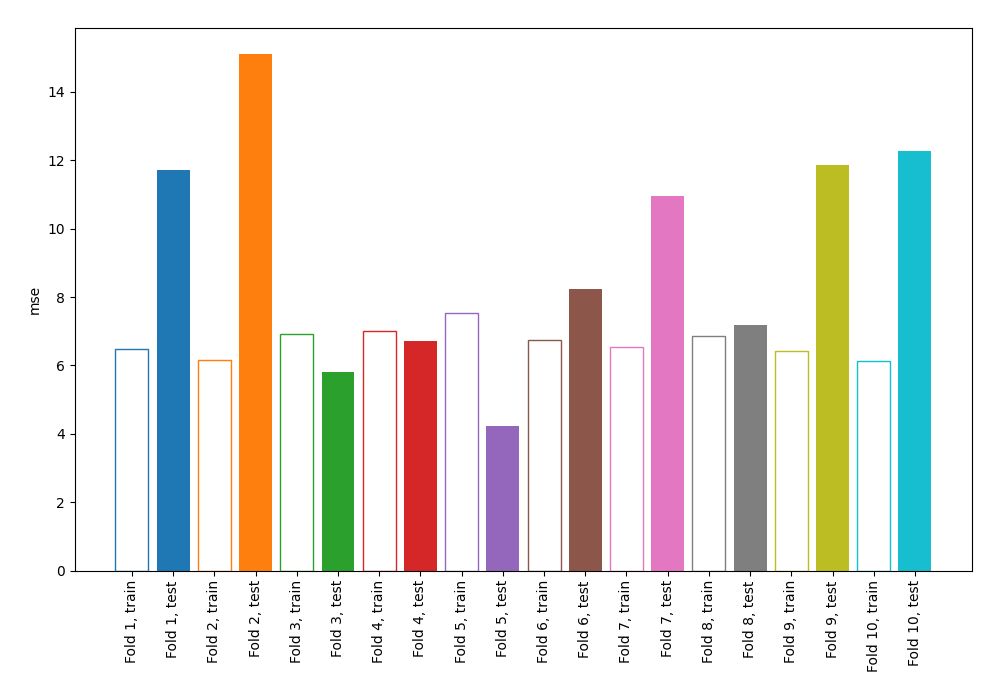
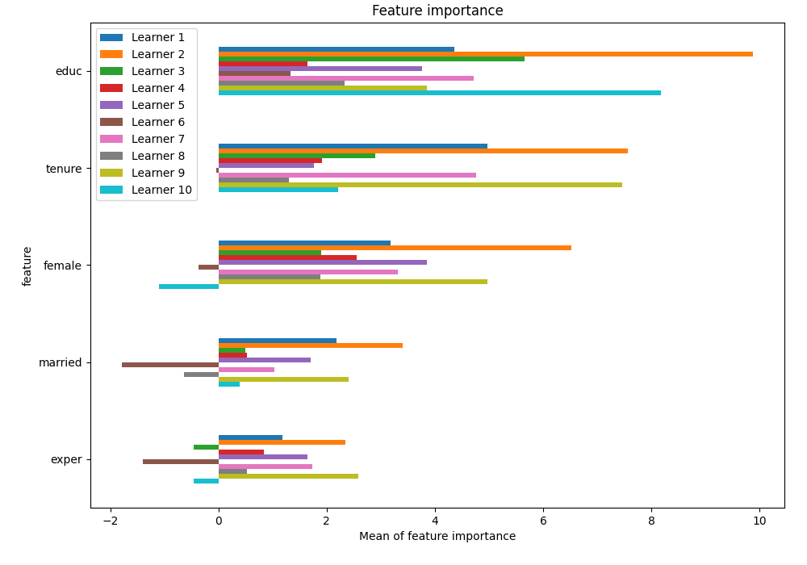
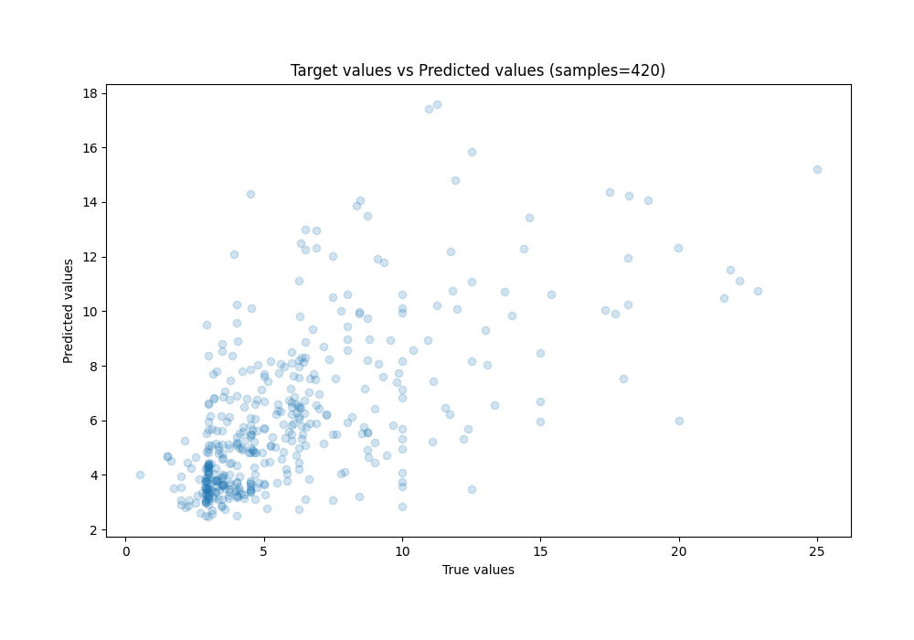
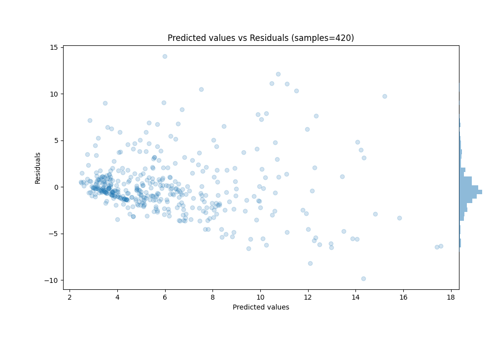

# Summary of 11_Default_NearestNeighbors

[<< Go back](../README.md)

## k-Nearest Neighbors (Nearest Neighbors)
- **n_jobs**: -1
- **n_neighbors**: 5
- **weights**: uniform
- **explain_level**: 1

## Validation
 - **validation_type**: kfold
 - **k_folds**: 10
 - **shuffle**: True
 - **random_seed**: 123

## Optimized metric
mse

## Training time

9.8 seconds

### Metric details:
| Metric   |    Score |
|:---------|---------:|
| MAE      | 2.08659  |
| MSE      | 9.41368  |
| RMSE     | 3.06817  |
| R2       | 0.382524 |
| MAPE     | 0.377063 |

## Learning curves

## Permutation-based Importance

## True vs Predicted

## Predicted vs Residuals

[<< Go back](../README.md)
