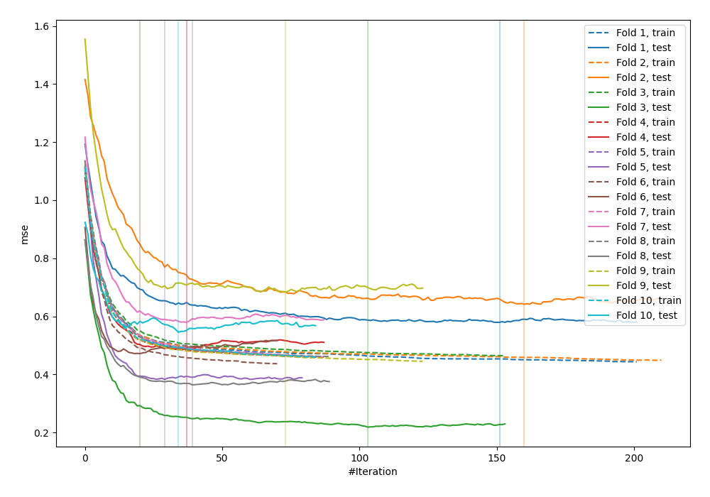
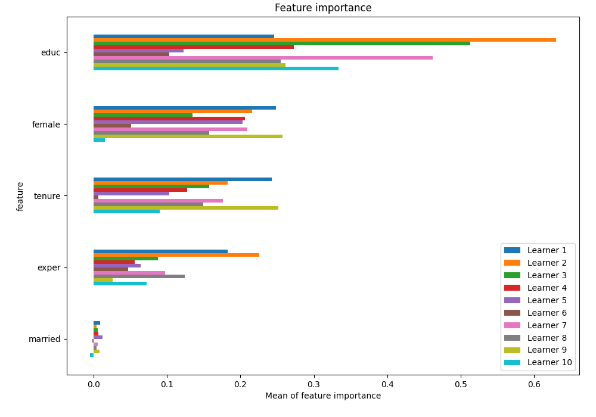
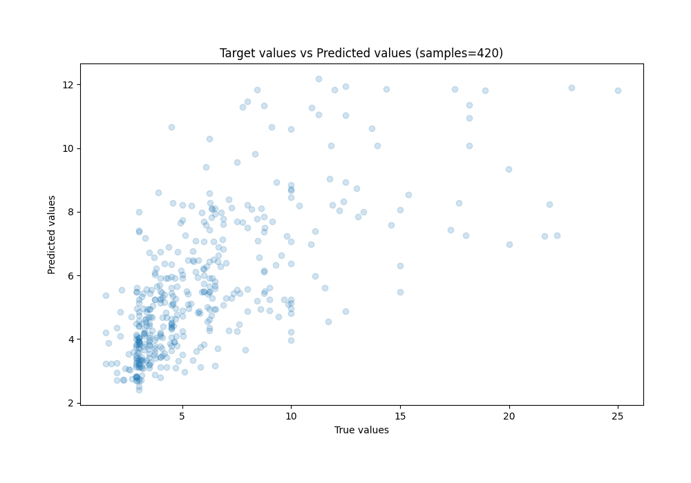
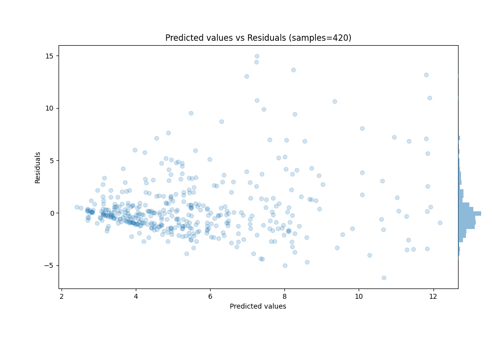

# Summary of 15_Xgboost

[<< Go back](../README.md)

## Extreme Gradient Boosting (Xgboost)
- **n_jobs**: -1
- **objective**: reg:squarederror
- **eta**: 0.15
- **max_depth**: 8
- **min_child_weight**: 50
- **subsample**: 0.6
- **colsample_bytree**: 0.6
- **eval_metric**: mse
- **explain_level**: 1

## Validation
 - **validation_type**: kfold
 - **k_folds**: 10
 - **shuffle**: True
 - **random_seed**: 123

## Optimized metric
mse

## Training time

12.8 seconds

### Metric details:
| Metric   |    Score |
|:---------|---------:|
| MAE      | 1.85237  |
| MSE      | 8.67595  |
| RMSE     | 2.9455   |
| R2       | 0.430049 |
| MAPE     | 0.303734 |

## Learning curves

## Permutation-based Importance

## True vs Predicted

## Predicted vs Residuals

[<< Go back](../README.md)
