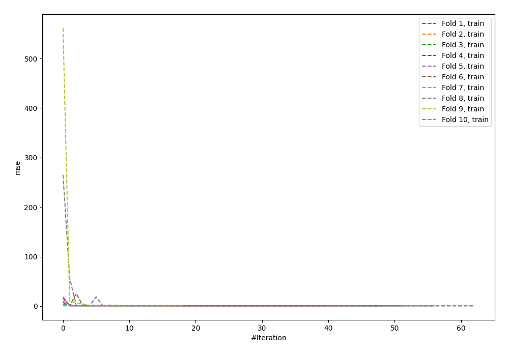
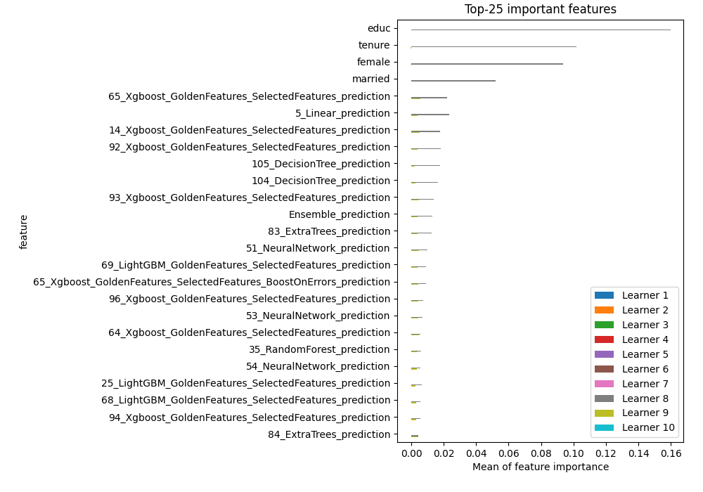
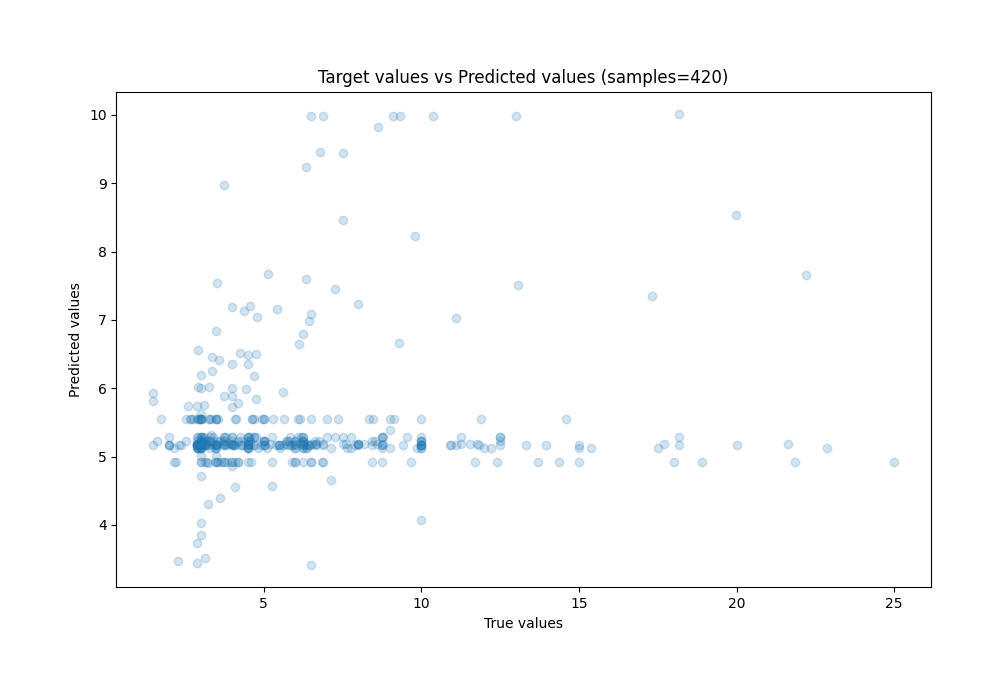
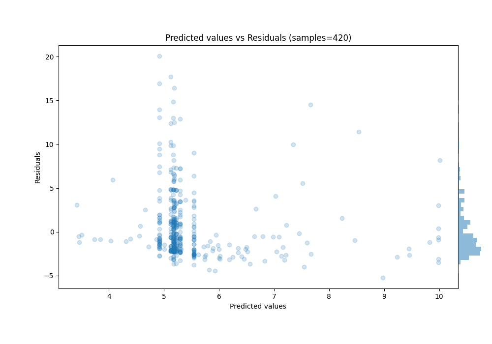

# Summary of 48_NeuralNetwork_Stacked

[<< Go back](../README.md)

## Neural Network
- **n_jobs**: -1
- **dense_1_size**: 32
- **dense_2_size**: 4
- **learning_rate**: 0.05
- **explain_level**: 1

## Validation
 - **validation_type**: kfold
 - **k_folds**: 10
 - **shuffle**: True
 - **random_seed**: 123

## Optimized metric
mse

## Training time

46.2 seconds

### Metric details:
| Metric   |       Score |
|:---------|------------:|
| MAE      |  2.66022    |
| MSE      | 15.2735     |
| RMSE     |  3.90813    |
| R2       | -0.00336692 |
| MAPE     |  0.473204   |

## Learning curves

## Permutation-based Importance

## True vs Predicted

## Predicted vs Residuals

[<< Go back](../README.md)
