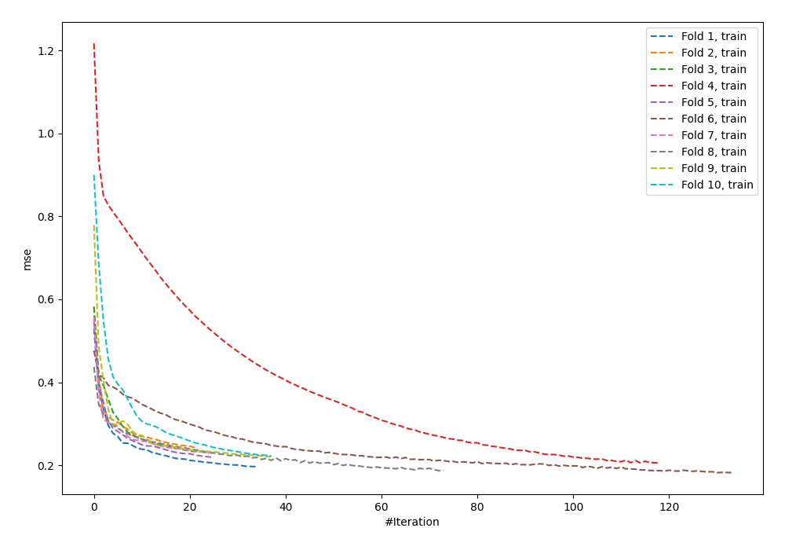
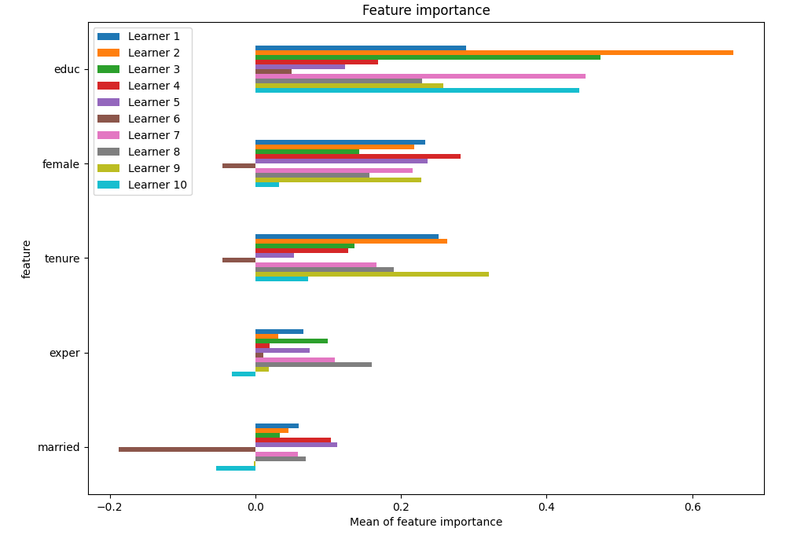
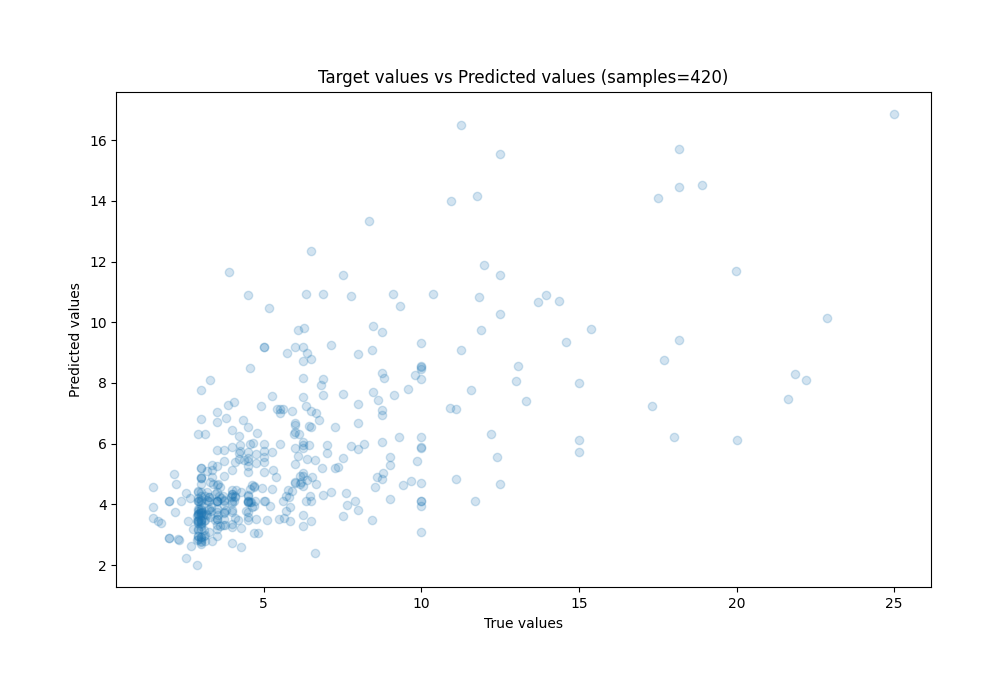
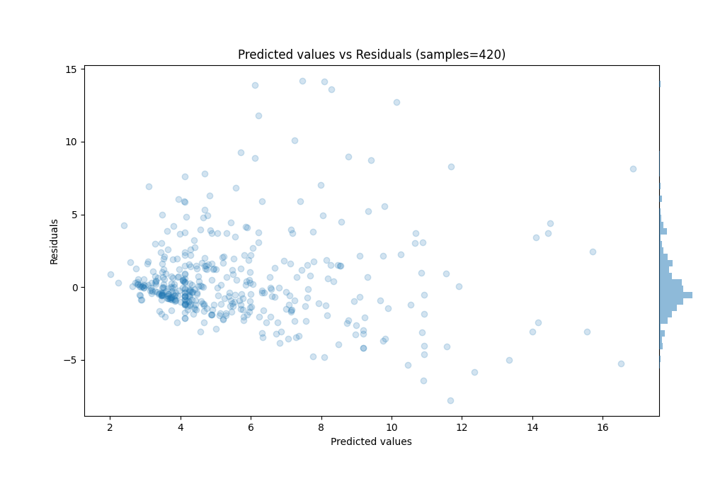

# Summary of 53_NeuralNetwork

[<< Go back](../README.md)

## Neural Network
- **n_jobs**: -1
- **dense_1_size**: 64
- **dense_2_size**: 4
- **learning_rate**: 0.01
- **explain_level**: 1

## Validation
 - **validation_type**: kfold
 - **k_folds**: 10
 - **shuffle**: True
 - **random_seed**: 123

## Optimized metric
mse

## Training time

14.0 seconds

### Metric details:
| Metric   |    Score |
|:---------|---------:|
| MAE      | 1.95246  |
| MSE      | 8.99421  |
| RMSE     | 2.99904  |
| R2       | 0.409141 |
| MAPE     | 0.319624 |

## Learning curves

## Permutation-based Importance

## True vs Predicted

## Predicted vs Residuals

[<< Go back](../README.md)
