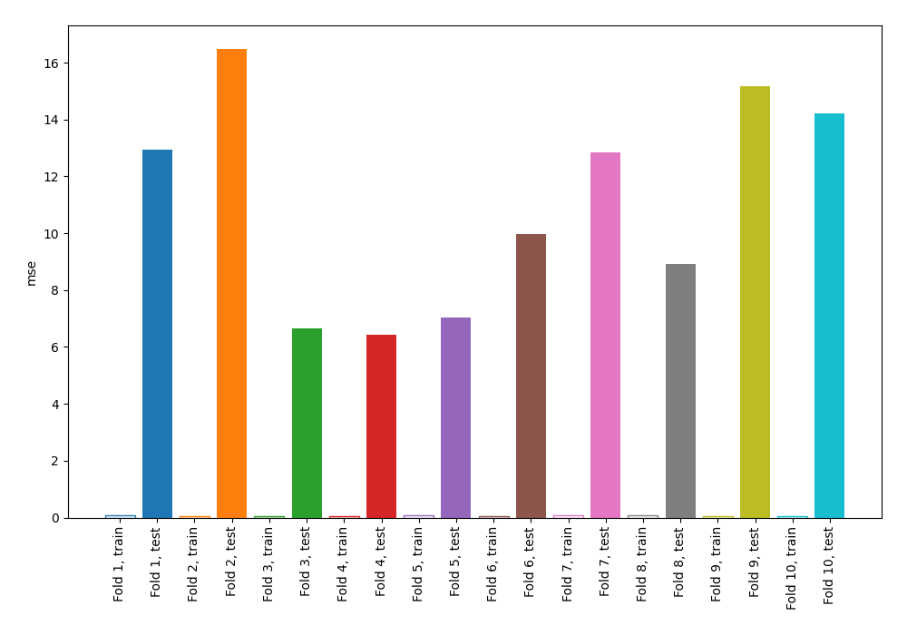
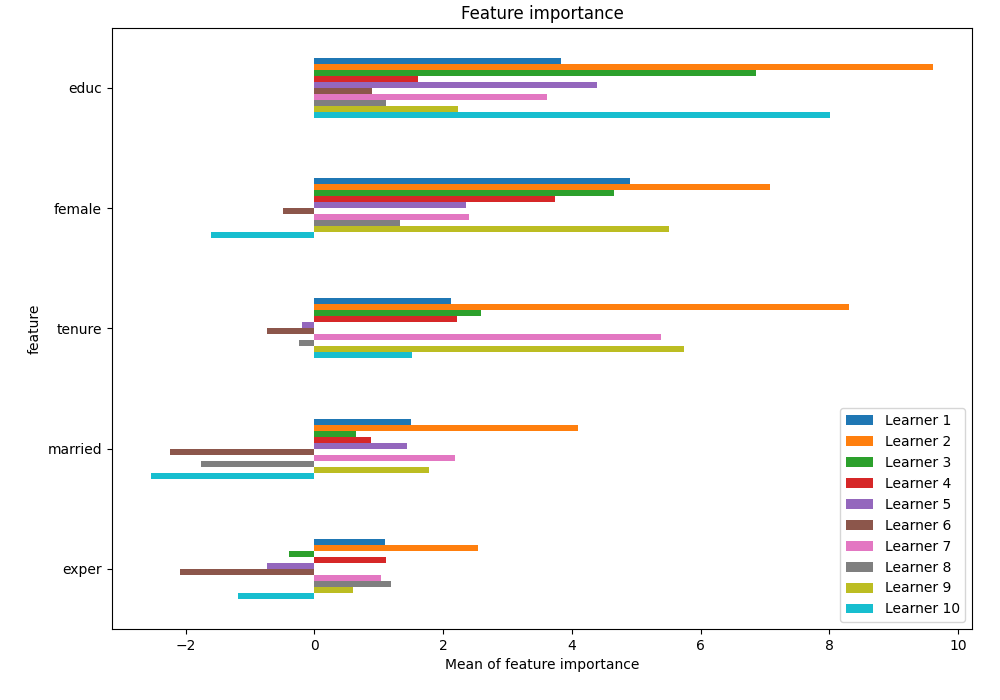
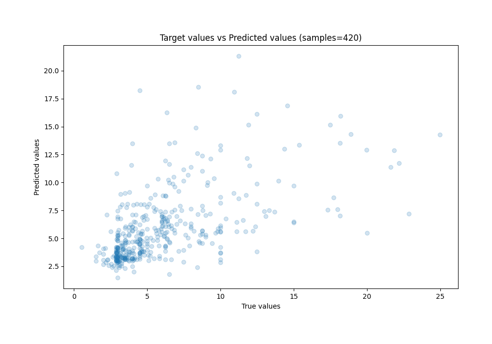
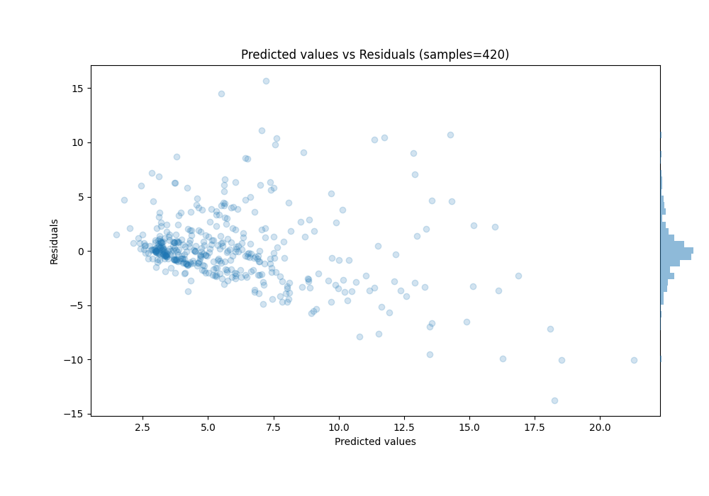

# Summary of 63_NearestNeighbors

[<< Go back](../README.md)

## k-Nearest Neighbors (Nearest Neighbors)
- **n_jobs**: -1
- **n_neighbors**: 3
- **weights**: distance
- **explain_level**: 1

## Validation
 - **validation_type**: kfold
 - **k_folds**: 10
 - **shuffle**: True
 - **random_seed**: 123

## Optimized metric
mse

## Training time

16.3 seconds

### Metric details:
| Metric   |     Score |
|:---------|----------:|
| MAE      |  2.20348  |
| MSE      | 11.0692   |
| RMSE     |  3.32704  |
| R2       |  0.273933 |
| MAPE     |  0.382579 |

## Learning curves

## Permutation-based Importance

## True vs Predicted

## Predicted vs Residuals

[<< Go back](../README.md)
