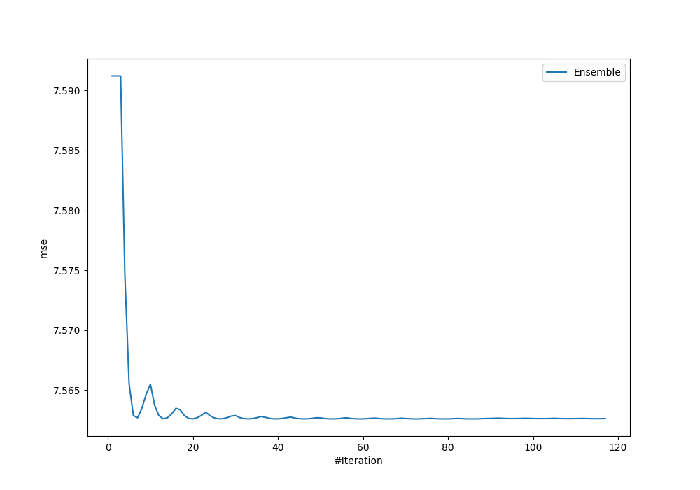
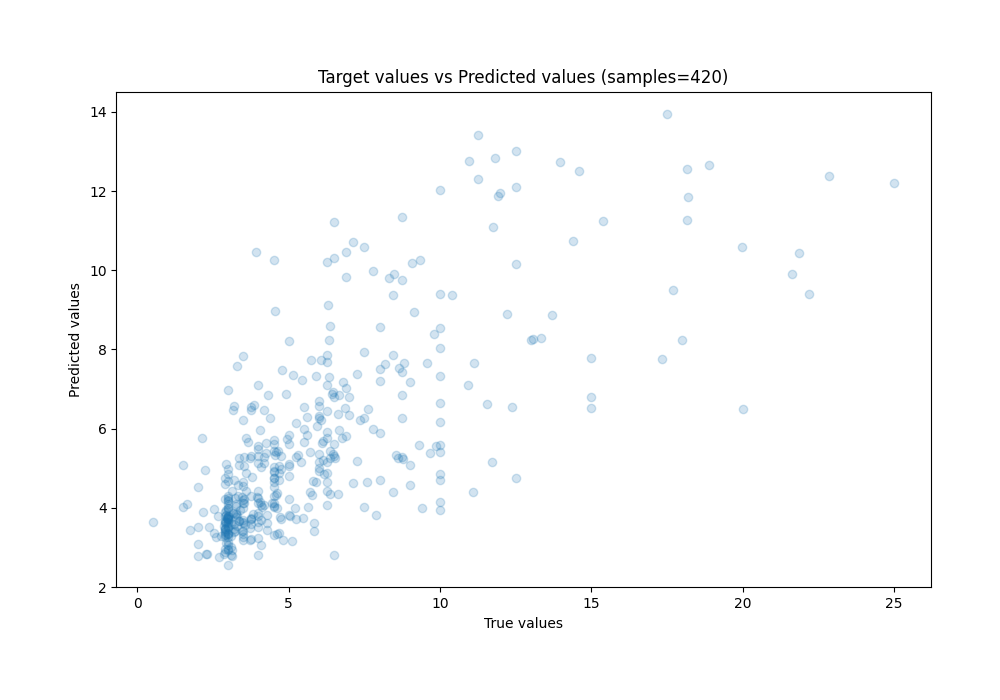
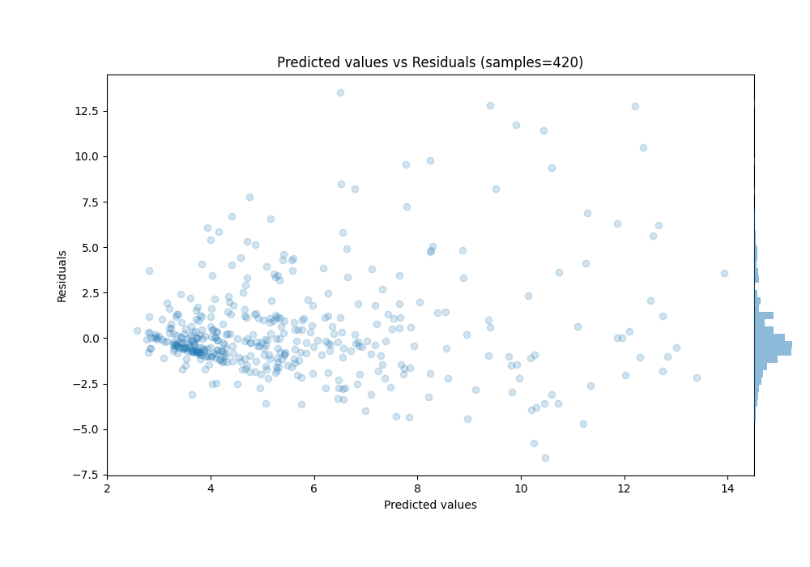

# Summary of Ensemble

[<< Go back](../README.md)

## Ensemble structure
| Model                                      |   Weight |
|:-------------------------------------------|---------:|
| 101_RandomForest                           |        5 |
| 65_Xgboost_GoldenFeatures_SelectedFeatures |       28 |

### Metric details:
| Metric   |    Score |
|:---------|---------:|
| MAE      | 1.73732  |
| MSE      | 7.56259  |
| RMSE     | 2.75002  |
| R2       | 0.503943 |
| MAPE     | 0.298046 |

## Learning curves

## True vs Predicted

## Predicted vs Residuals

[<< Go back](../README.md)
