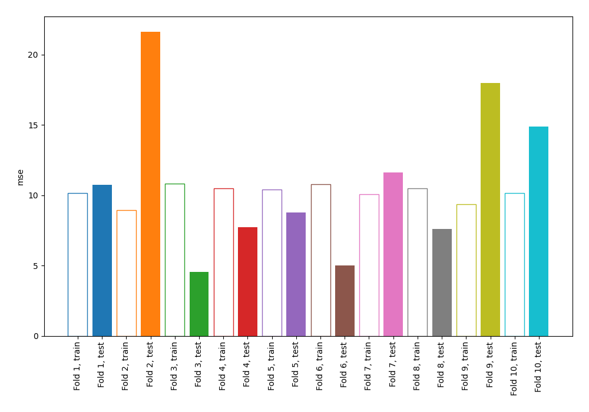
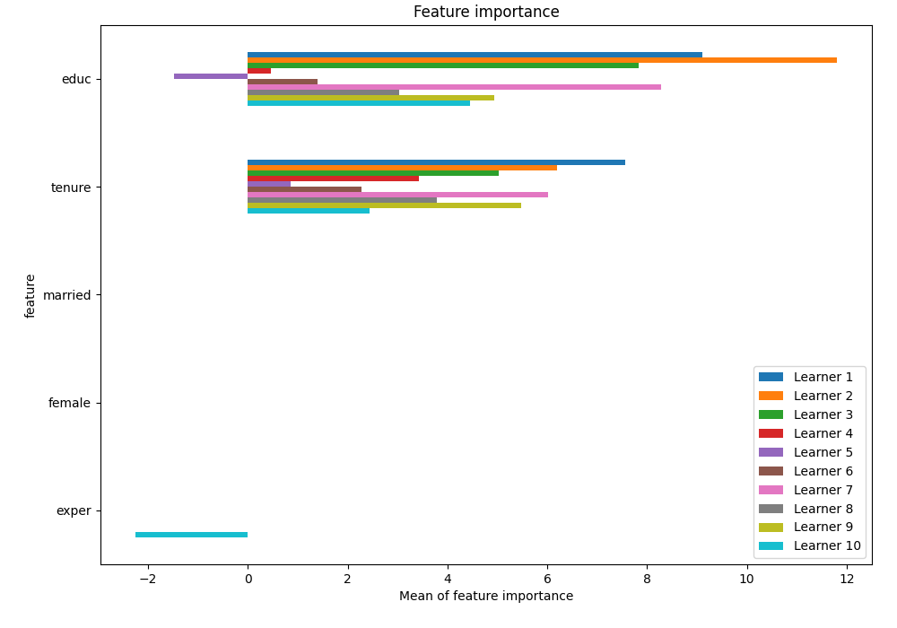
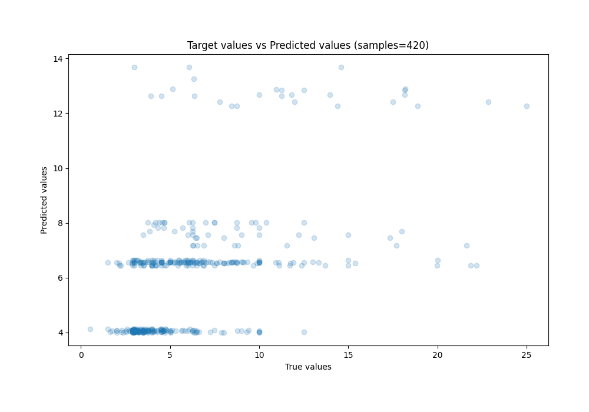
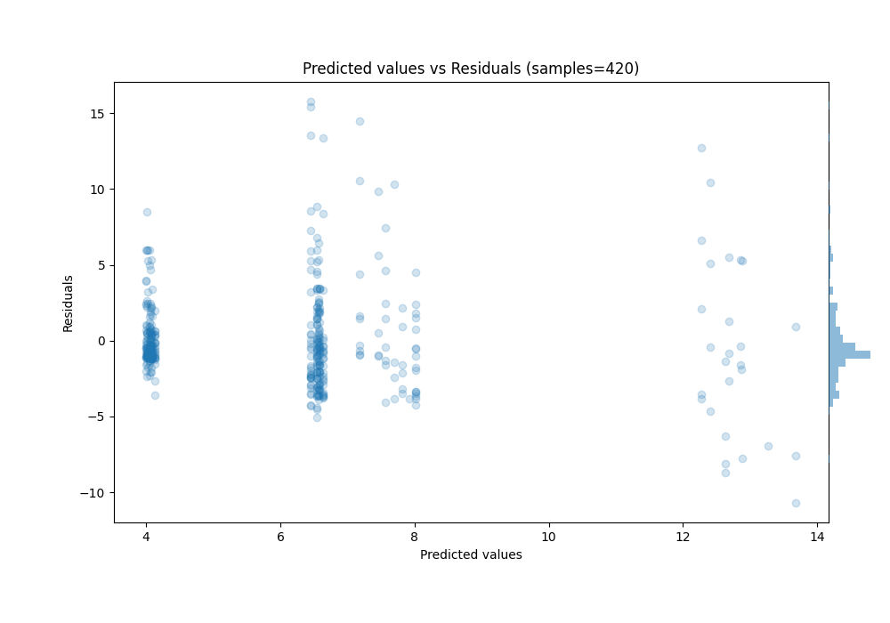

# Summary of 104_DecisionTree

[<< Go back](../README.md)

## Decision Tree
- **n_jobs**: -1
- **criterion**: friedman_mse
- **max_depth**: 2
- **explain_level**: 1

## Validation
 - **validation_type**: kfold
 - **k_folds**: 10
 - **shuffle**: True
 - **random_seed**: 123

## Optimized metric
mse

## Training time

23.7 seconds

### Metric details:
| Metric   |     Score |
|:---------|----------:|
| MAE      |  2.24649  |
| MSE      | 11.0458   |
| RMSE     |  3.32352  |
| R2       |  0.275469 |
| MAPE     |  0.428673 |

## Learning curves

## Permutation-based Importance

## True vs Predicted

## Predicted vs Residuals

[<< Go back](../README.md)
