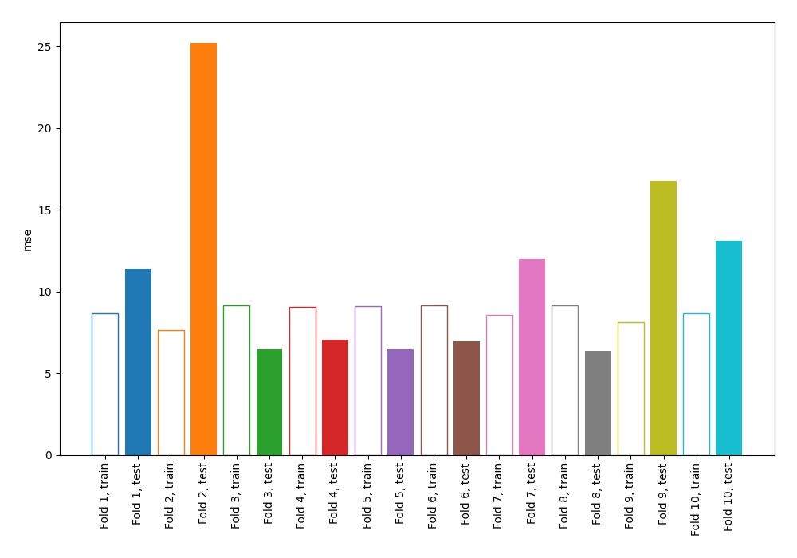
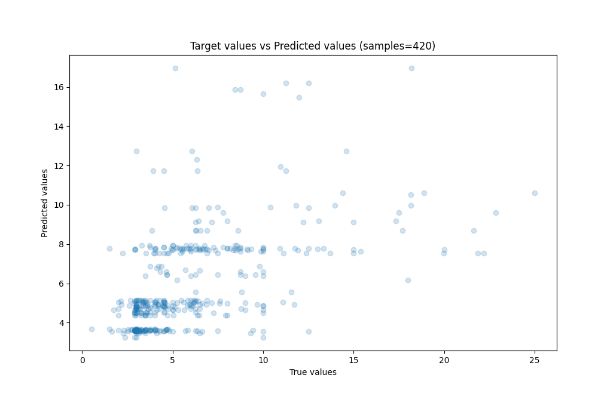
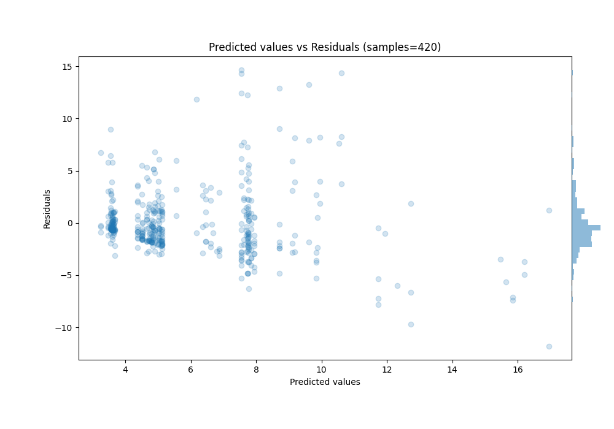

# Summary of 2_DecisionTree

[<< Go back](../README.md)

## Decision Tree
- **n_jobs**: -1
- **criterion**: squared_error
- **max_depth**: 3
- **explain_level**: 1

## Validation
 - **validation_type**: kfold
 - **k_folds**: 10
 - **shuffle**: True
 - **random_seed**: 123

## Optimized metric
mse

## Training time

14.0 seconds

### Metric details:
| Metric   |     Score |
|:---------|----------:|
| MAE      |  2.26818  |
| MSE      | 11.1807   |
| RMSE     |  3.34375  |
| R2       |  0.266621 |
| MAPE     |  0.414155 |

## Learning curves

## Permutation-based Importance

## True vs Predicted

## Predicted vs Residuals

[<< Go back](../README.md)
