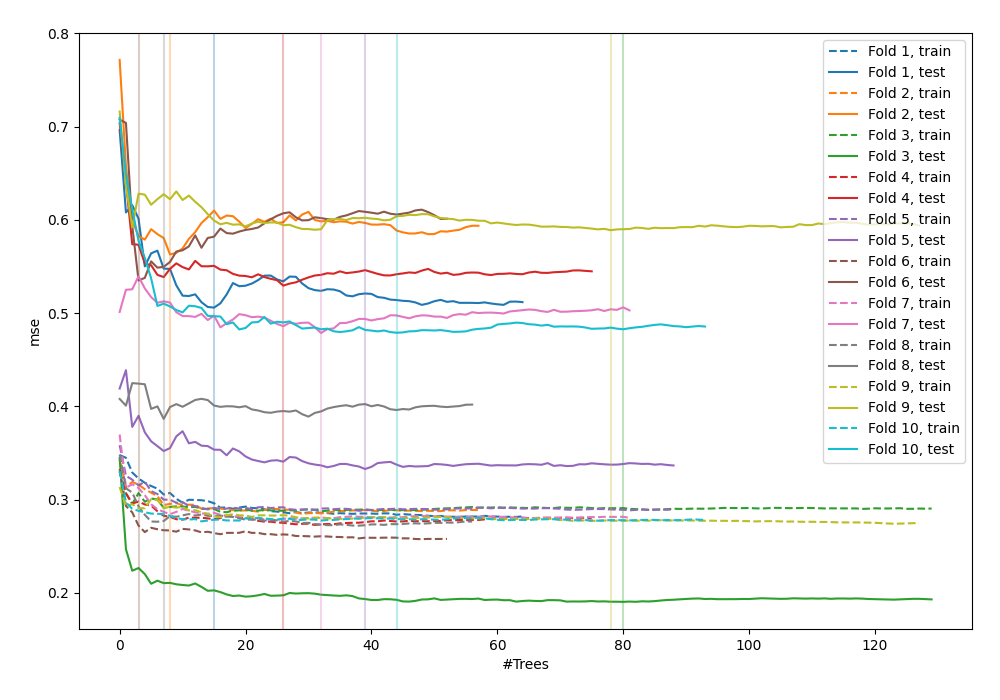
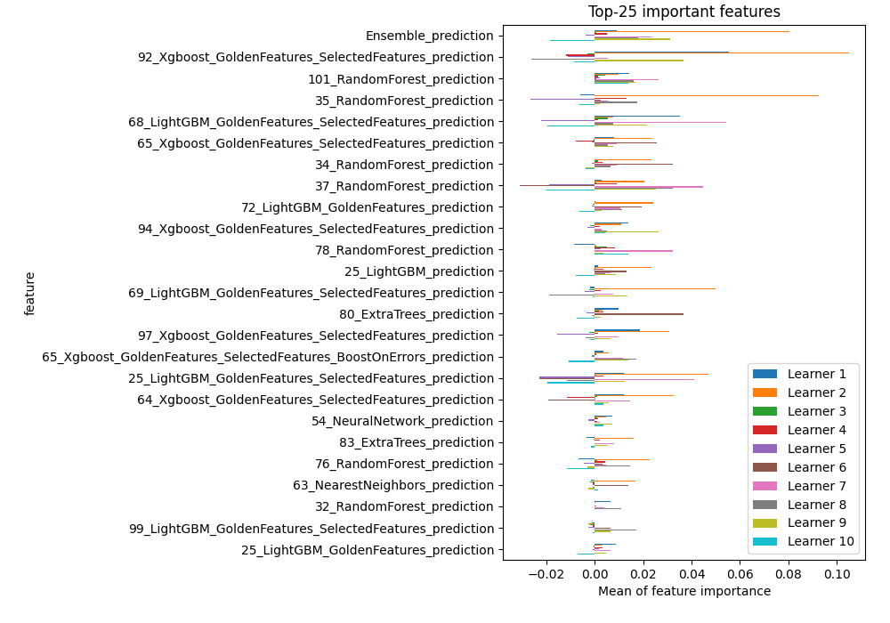
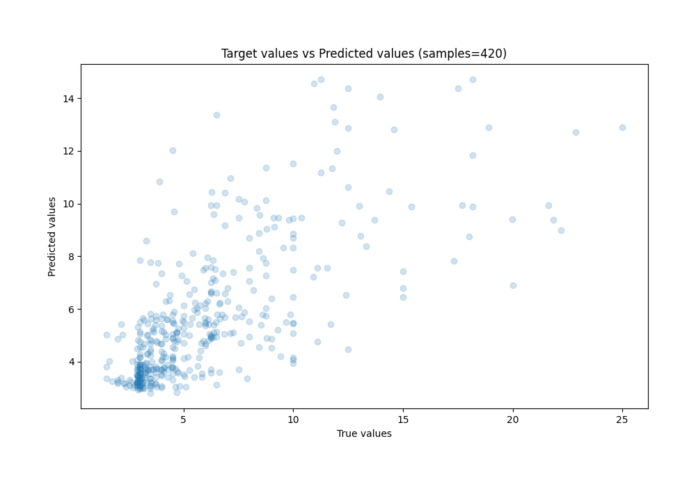
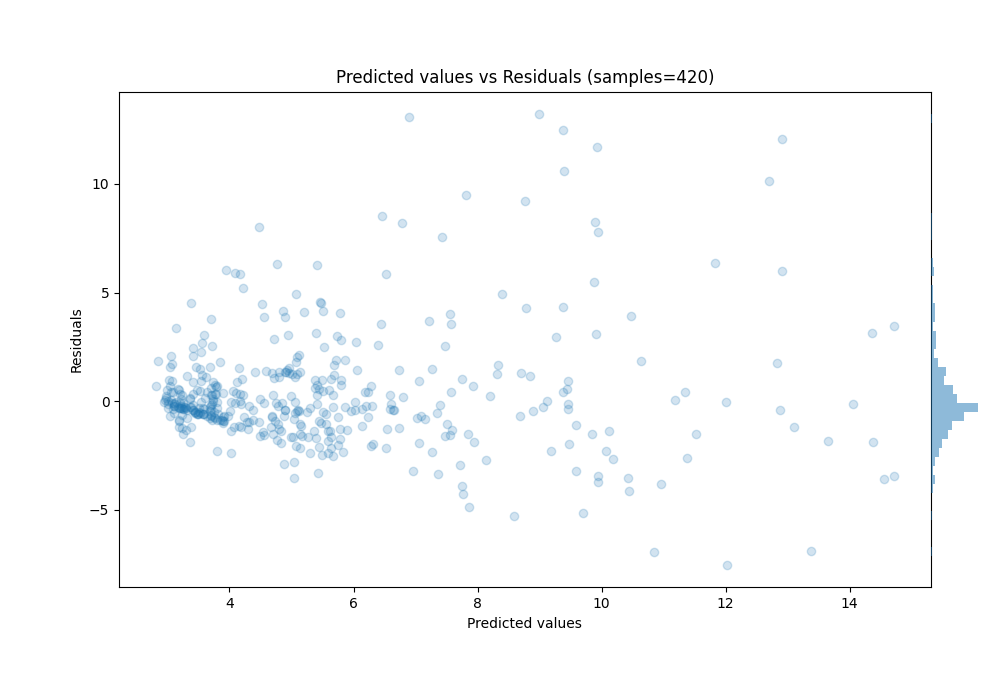

# Summary of 44_ExtraTrees_Stacked

[<< Go back](../README.md)

## Extra Trees Regressor (Extra Trees)
- **n_jobs**: -1
- **criterion**: squared_error
- **max_features**: 1.0
- **min_samples_split**: 40
- **max_depth**: 7
- **eval_metric_name**: mse
- **explain_level**: 1

## Validation
 - **validation_type**: kfold
 - **k_folds**: 10
 - **shuffle**: True
 - **random_seed**: 123

## Optimized metric
mse

## Training time

87.4 seconds

### Metric details:
| Metric   |    Score |
|:---------|---------:|
| MAE      | 1.75152  |
| MSE      | 7.76822  |
| RMSE     | 2.78715  |
| R2       | 0.48968  |
| MAPE     | 0.289753 |

## Learning curves

## Permutation-based Importance

## True vs Predicted

## Predicted vs Residuals

[<< Go back](../README.md)
