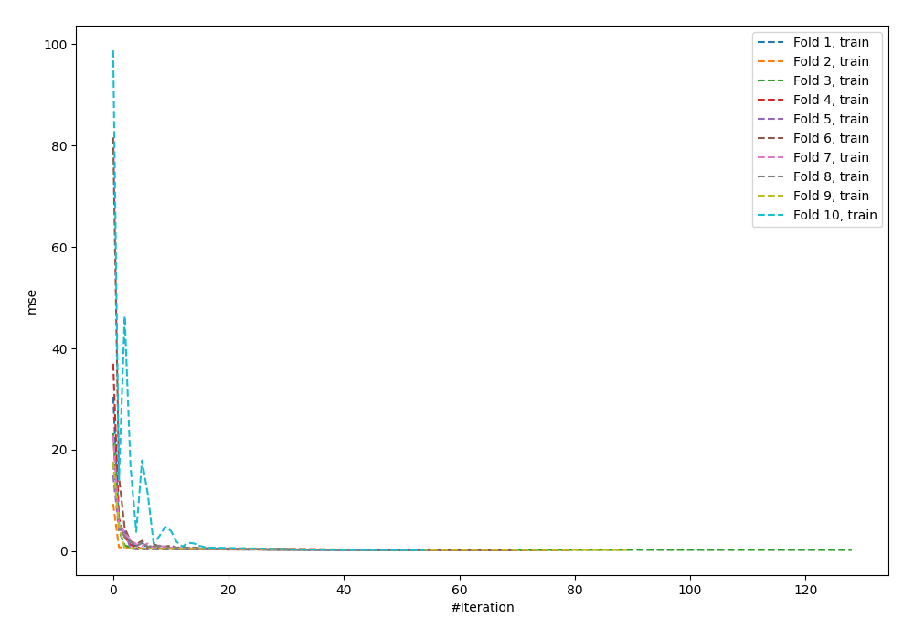
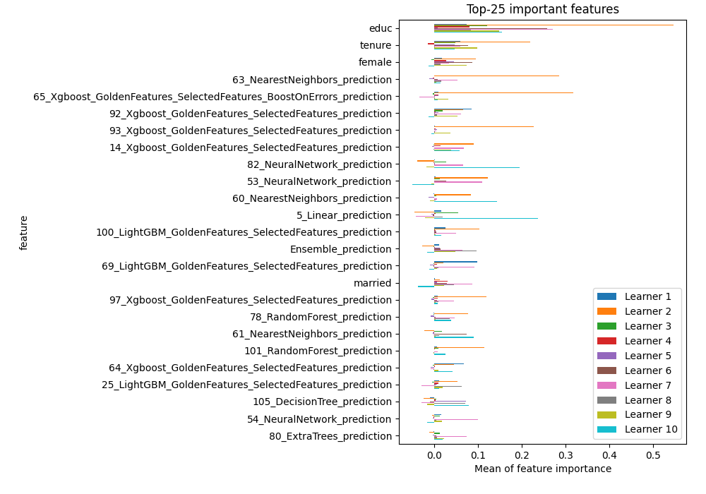
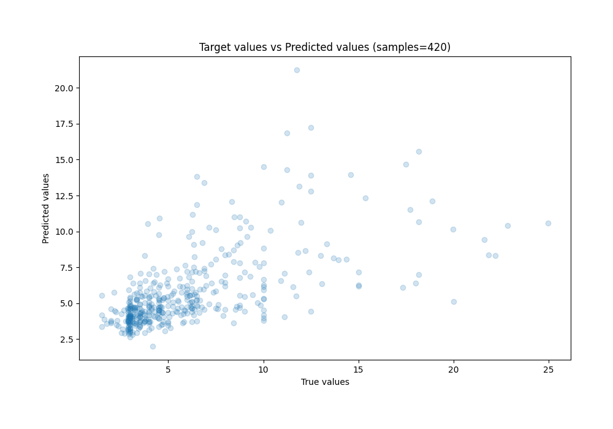
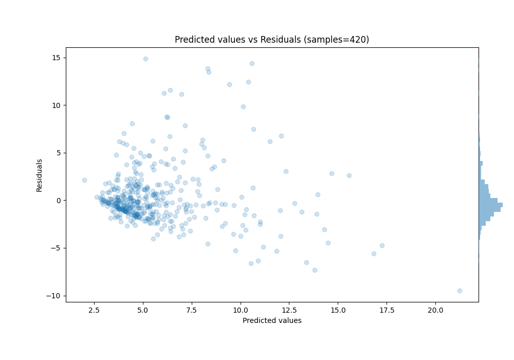

# Summary of 52_NeuralNetwork_Stacked

[<< Go back](../README.md)

## Neural Network
- **n_jobs**: -1
- **dense_1_size**: 64
- **dense_2_size**: 16
- **learning_rate**: 0.01
- **explain_level**: 1

## Validation
 - **validation_type**: kfold
 - **k_folds**: 10
 - **shuffle**: True
 - **random_seed**: 123

## Optimized metric
mse

## Training time

41.1 seconds

### Metric details:
| Metric   |    Score |
|:---------|---------:|
| MAE      | 1.99385  |
| MSE      | 9.63794  |
| RMSE     | 3.1045   |
| R2       | 0.366852 |
| MAPE     | 0.332911 |

## Learning curves

## Permutation-based Importance

## True vs Predicted

## Predicted vs Residuals

[<< Go back](../README.md)
