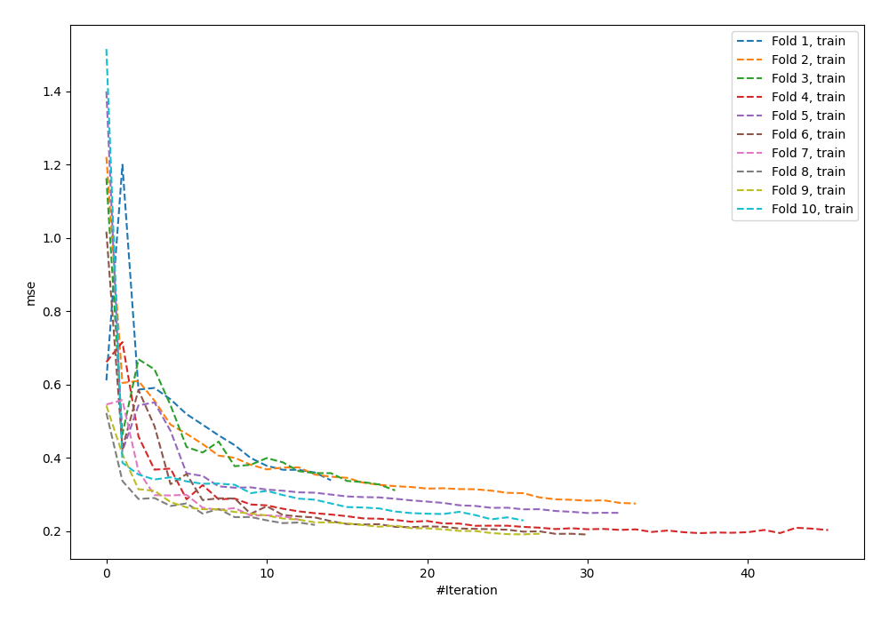
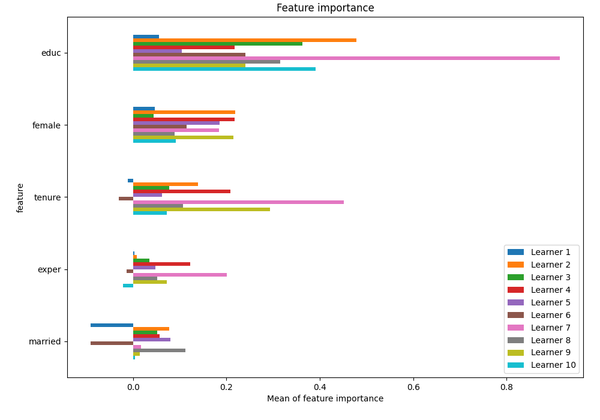
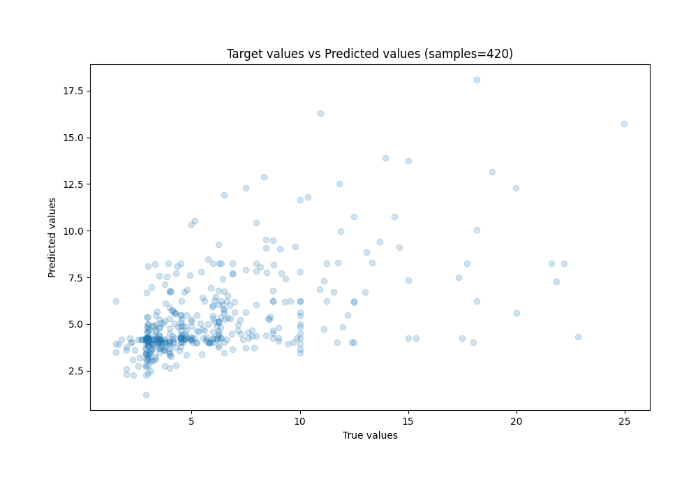
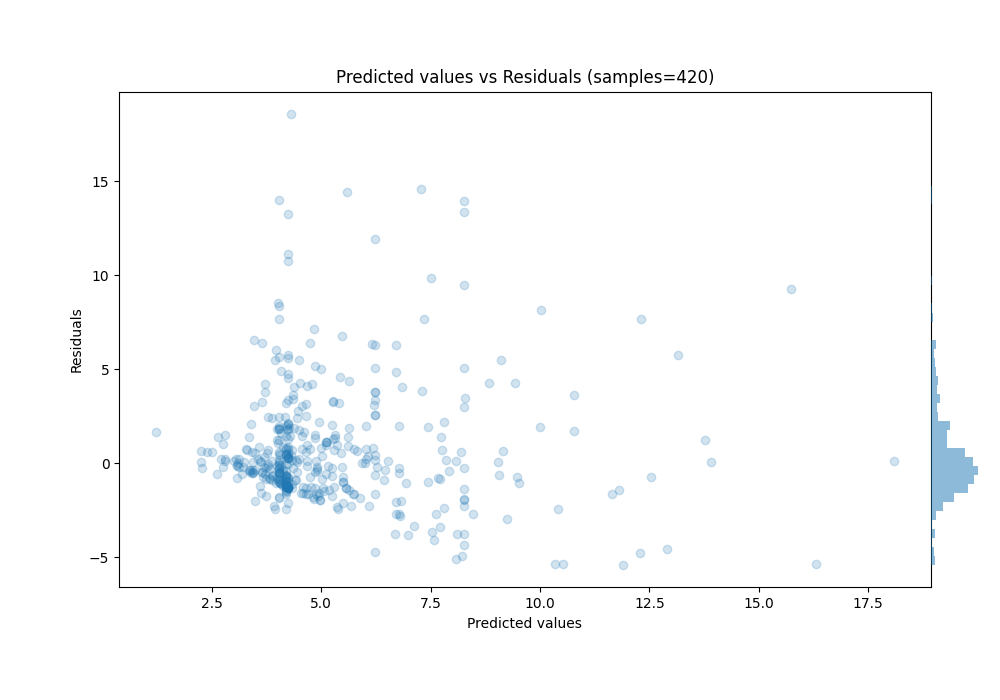

# Summary of 55_NeuralNetwork

[<< Go back](../README.md)

## Neural Network
- **n_jobs**: -1
- **dense_1_size**: 64
- **dense_2_size**: 8
- **learning_rate**: 0.1
- **explain_level**: 1

## Validation
 - **validation_type**: kfold
 - **k_folds**: 10
 - **shuffle**: True
 - **random_seed**: 123

## Optimized metric
mse

## Training time

15.2 seconds

### Metric details:
| Metric   |     Score |
|:---------|----------:|
| MAE      |  2.08918  |
| MSE      | 11.0083   |
| RMSE     |  3.31787  |
| R2       |  0.27683  |
| MAPE     |  0.334435 |

## Learning curves

## Permutation-based Importance

## True vs Predicted

## Predicted vs Residuals

[<< Go back](../README.md)
