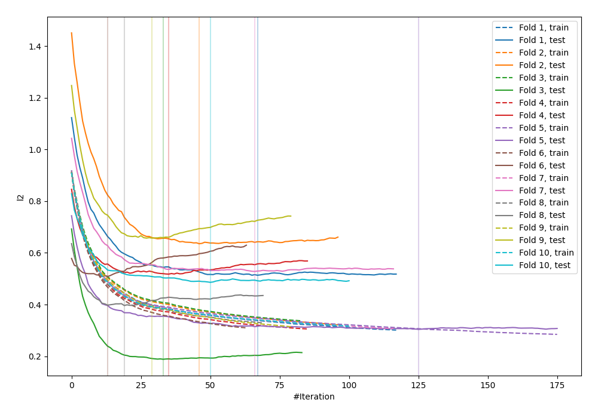
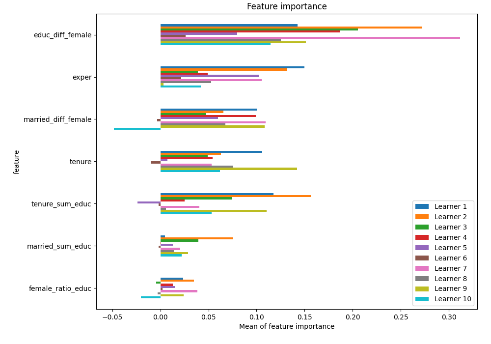
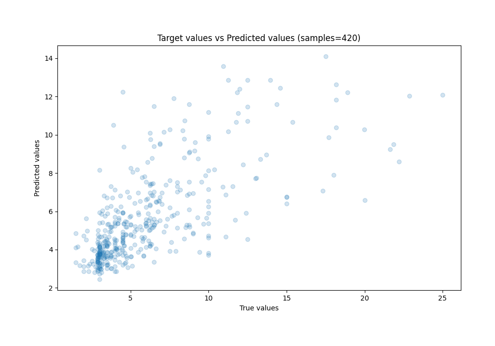
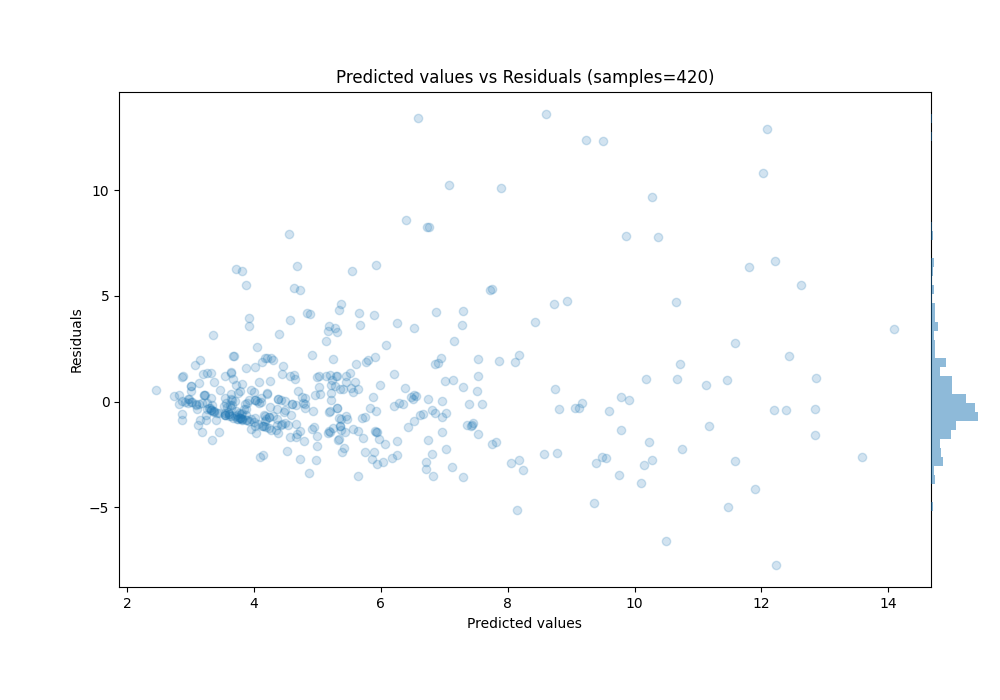

# Summary of 99_LightGBM_GoldenFeatures_SelectedFeatures

[<< Go back](../README.md)

## LightGBM
- **n_jobs**: -1
- **objective**: regression
- **num_leaves**: 95
- **learning_rate**: 0.1
- **feature_fraction**: 0.5
- **bagging_fraction**: 1.0
- **min_data_in_leaf**: 30
- **metric**: l2
- **custom_eval_metric_name**: None
- **explain_level**: 1

## Validation
 - **validation_type**: kfold
 - **k_folds**: 10
 - **shuffle**: True
 - **random_seed**: 123

## Optimized metric
mse

## Training time

24.3 seconds

### Metric details:
| Metric   |    Score |
|:---------|---------:|
| MAE      | 1.79429  |
| MSE      | 8.05634  |
| RMSE     | 2.83837  |
| R2       | 0.470753 |
| MAPE     | 0.297975 |

## Learning curves

## Permutation-based Importance

## True vs Predicted

## Predicted vs Residuals

[<< Go back](../README.md)
