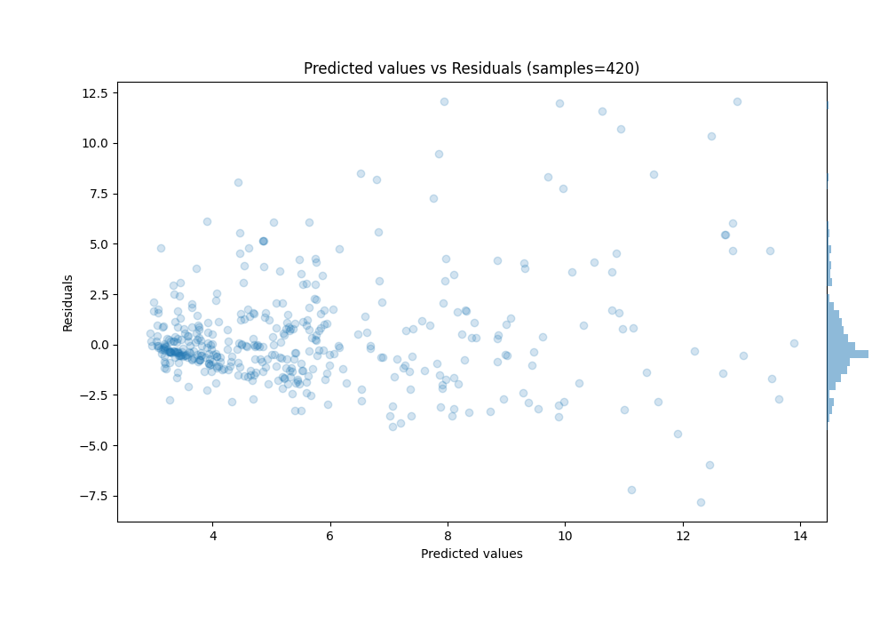

# Summary of Ensemble_Stacked

[<< Go back](../README.md)

## Ensemble structure
| Model                                               |   Weight |
|:----------------------------------------------------|---------:|
| 37_RandomForest_Stacked                             |       36 |
| 38_RandomForest_Stacked                             |       13 |
| 68_LightGBM_GoldenFeatures_SelectedFeatures_Stacked |        1 |
| 72_LightGBM_GoldenFeatures_Stacked                  |       50 |
| 78_RandomForest_Stacked                             |       32 |
| 87_ExtraTrees_Stacked                               |        7 |

### Metric details:
| Metric   |    Score |
|:---------|---------:|
| MAE      | 1.72969  |
| MSE      | 7.14339  |
| RMSE     | 2.67271  |
| R2       | 0.53144  |
| MAPE     | 0.297984 |

## Learning curves

## True vs Predicted

## Predicted vs Residuals

[<< Go back](../README.md)
